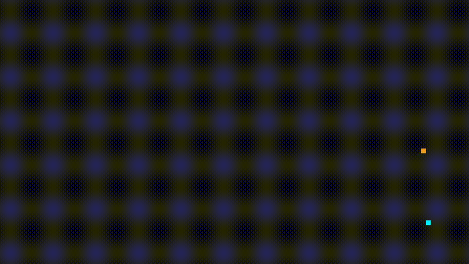

# Grid Wars

Hello user,

welcome to the Grid. 

The programs have noticed your arrival. That is why you will have to prove yourself in the arena. It is only you, your Light Cycle and the enemy.

Your Light Cycle is powered by pure liquid energy, it has two speed modes and the Light Ribbons it produces can be toggled on or off at any time. Let your opponent ride into them and you will win the game.

If you can overcome this challenge, the grid will light up in your color.

## Getting Started

1. `git clone git@github.com:oglinuk/grid-wars.git`
2. Install dependencies
3. `mkdir build && cd build`
4. `cmake .. && make`
5. `./grid-wars`

## Dependencies

This project was built using only C++ and SDL2.

* cmake >= 3.7
  * All OSes: [click here for installation instructions](https://cmake.org/install/)
* make >= 4.1 (Linux, Mac), 3.81 (Windows)
  * Linux: make is installed by default on most Linux distros
  * Mac: [install Xcode command line tools to get make](https://developer.apple.com/xcode/features/)
  * Windows: [Click here for installation instructions](http://gnuwin32.sourceforge.net/packages/make.htm)
* SDL2 >= 2.0
  * All installation instructions can be found [here](https://wiki.libsdl.org/Installation)
* gcc/g++ >= 5.4
  * Linux: gcc / g++ is installed by default on most Linux distros
  * Mac: same deal as make - [install Xcode command line tools](https://developer.apple.com/xcode/features/)
  * Windows: recommend using [MinGW](http://www.mingw.org/)

## Controls

* Press any key to start.
* Directional controls
  * User (blue): WASD
  * Program (orange): IJKL
* Activate and deactivate the Light Ribbon
  * User (blue): E
  * Program (orange): O
* Toggle between high and low speed
  * User (blue): Q
  * Program (orange): U
* Press enter to repeat.

## Program Structure

* Input: A class that handles all input events
* Game: Contains the main game loop (Input, Update, Render) and keeps track of the frame rate. It has two instances of the player class as attributes.
* Player: Handles the logic (position, movement and collision detection)
* Graphics: Handles the all things graphics (window and renderer)

## TODO

* [ ] Add music

## Attribution

"[TRON-CPP](https://github.com/eilerstim/TRON-CPP)" by [eilerstim](https://github.com/eilerstim) is licensed under [CC 4.0](https://creativecommons.org/licenses/by/4.0/)
